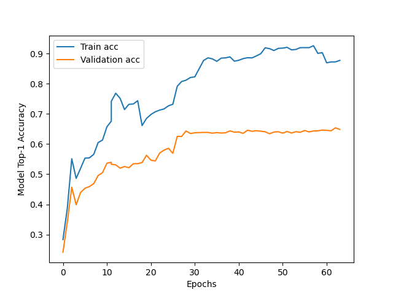
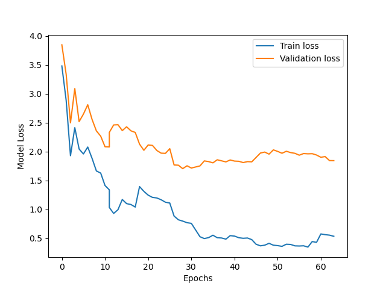
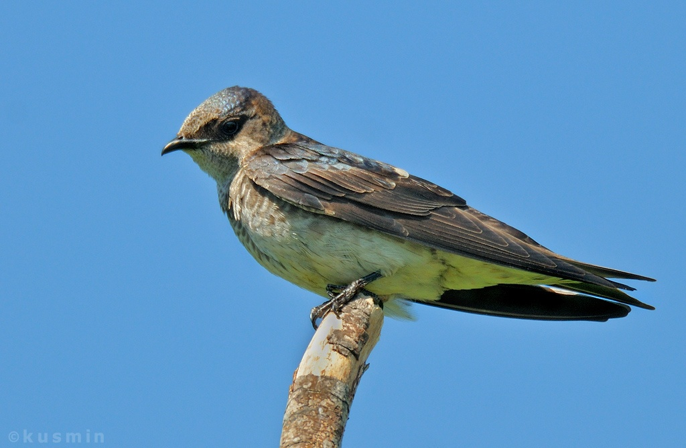
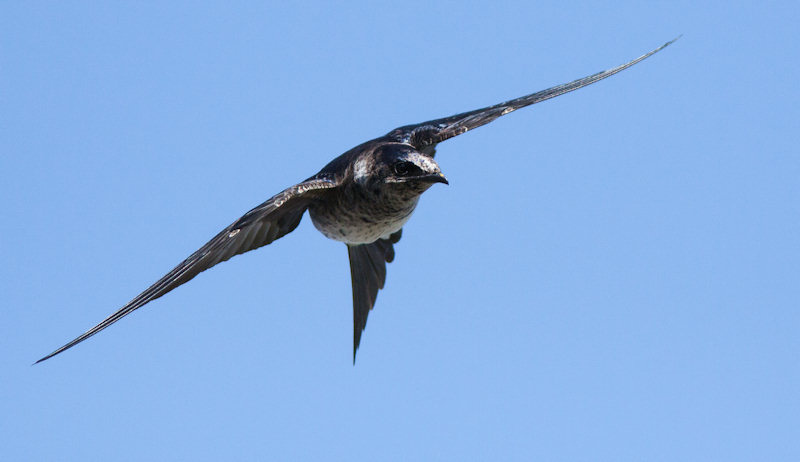
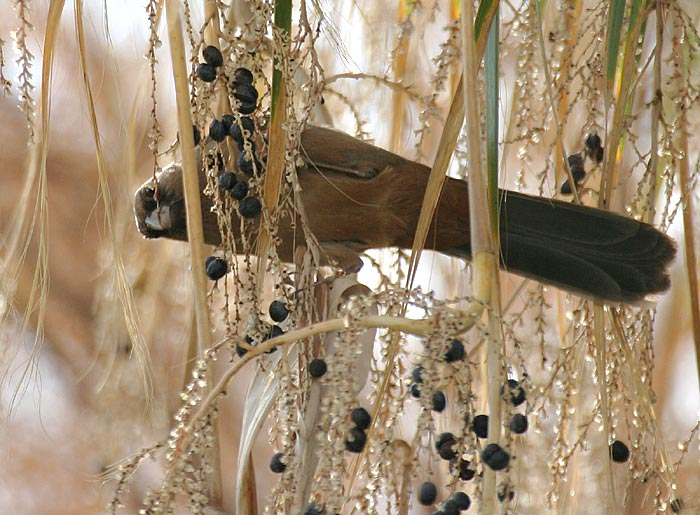

# CSE455-bird-classification

## Group Members
Robin Yang, Jack Zhang

## Problem description
For our project, we decided to go with the recommended bird classification. The task is to identify the species of a bird from its image.
We also have a [video](https://drive.google.com/file/d/10yLrDJjzY493yPwQlqqI5LIGVqSXno1j/view?usp=sharing) describing it

## Dataset and Technologies used
Our dataset is from [kaggle](https://www.kaggle.com/c/birds-22wi/data). The dataset contained more than 500 birds species to classify, with over 20k of images of training data.
Seeing how this is a relatively sophisticated computer vision task, we decided to use a [ResNet18](https://arxiv.org/abs/1512.03385) model. We also used a pretrained model to take advantage of the feature extracting. Although our data have different sizes, CNN uses convolution layers and pooling layers for its main connections, which means we don't have to do any cropping. We downsampled our images to $224 \times 224$ to fit the original ResNet18 input size, and changed the final fully connected layer to have the same amount of class size. This is all implemented with PyTorch.

We adapted code from the transfer learning [tutorial](https://pytorch.org/tutorials/beginner/transfer_learning_tutorial.html)
and use it on Google Colab. We rewrote the data processing, model training and saving
process to build a pipeline from downloading data to training. It saves all models
on Google Drive for future use. Since we used a pretrained model, we only need
to change the last layer without defining the whole network. We did try some other
models like MobileNetV3, but we decided to use ResNet18 as training is affordable
and it has good performance.

## Training Methodology
We used cross entropy as the final loss metric for our model, as it fits well for a classification task. For our optimizer, we used stochastic gradient descent with a batch size of 16. We chose an initial learning rate of $5e-2$, and used a scheduler to decrease it exponentially every 7 epochs. The dataset didn't come with any testing labels, so we divided our dataset into training and validation sets for evaluating the model mid-training. We trained our model on [Google Colab](https://colab.research.google.com/) using their GPUs. Unfortunately, the training time exceeded the personal use limit for Google Colab, so we saved our model checkpoints and trained on several accounts. We trained for a total of around 4 days, and trained for over 80 epochs in total.

## Training Result and Model Evaluation
1. Here we provide our loss vs. epoch and model accuracy vs epoch graphs.
   
   
   We see that
   although the model plateau in training, the exponentially decreasing learning rate helps
   with model convergence. At the end, we've trained for more than 20 epochs with varying learning
   rate, but our test accuracy sees little improvement. This tells us that with our model and our
   data, we've more or less reached a limit, which is why we decided to stop training. 
   We also see that the model performs similarly on training set
   and validation set in the beginning, but diverges as training goes on. This tells us that
   we've introduced overfitting into our model.

2. By the end, our model achieved roughly 88% accuracy on the training set and 65% on the validation set. This shows that there is
   still a large amount of overfitting in the model. Additionally, we expected a higher performance from a model that
   was state-of-the-art just a few years back. This could be due to the fact that there are too many classes for the model
   to handle, and therefore too many patterns to learn. Some of the classes also have as few as 30 instances in total, which
   could both attribute to the overfitting of the model (not enough variance in the data) and to the model's relativly
   poor performance.
    
3. By looking at some of the instances where the model is confused, it does seem like some of them are either
   from a class where there are relatively few training examples, or where the bird photoed is in a weird
   position. It can be concluded that the model still has a reasonable performance.
   Here are some of the examples which confused[^1] our model the most:

   
   
   

## Some problem we encountered
1. Like stated above, Google Colab disallows us to train continuously for more than 12 hours, so the training process was run a
   few times. Dataset was split randomly so each time we get a different train and test dataset.
   We then fixed the issue using a fixed random seed. 
   
2. Another problem was that we were not saving optimizer and scheduler initially, but we realized the problem after
   getting a low accuracy after loading a saved model. Because of these issues, the first 22 epochs were discarded, and
   we retrained from the start.
   
[^1]: Measured by how close the prediction is to the average vector.
